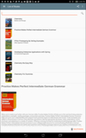
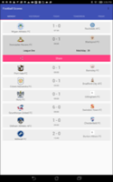
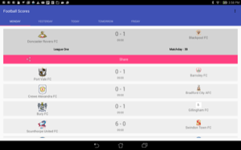
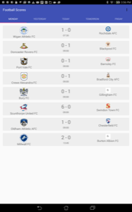

# SuperDuo

This Android Developer Nanodegree project starts with 2 existing projects:

- **Alexandria** - A book list and barcode scanner app.
- **Football Scores** - An app that displays current and future football(soccer) matches.

## Objectives 
- Fix existing issues with both apps.
- Make both apps accessible to sight-impaired users.
- Allow the app to be localized for distribution to other countries.
- Handle Android error cases.
- Add a widget to the Football Scores App.
- Add bar code scanning to Alexandria.
- Use at least one outside library for the required functions in the apps.

## Alexandria
This project was originally developed by Sascha Jaschke.  It was adapted to be suitable as a project by Udacity.
The [Google Books API](https://developers.google.com/books) was used to retreive all book information and images. 

### Enhancements 
- The app was updated the App to material design.
- Scanning functionality was added using the [ZBar](http://zbar.sourceforge.net) library.
- Tablet layout was redone.
- The navigation drawer was updated to material design.
- [Glide](https://github.com/bumptech/glide) library was used to speed up image loading.
### Installation
Download the zip file and extract the contents.  From Android Studio, File - New  - Import Project. Then navigate to the top level of the Alexandria project and click Ok.  The project should work.

### Issues
Automatic Barcode scanning is only available for devices with cameras that support autofocus. This app will only run on devices with Android 4.2 or later.
### License
Licensed under the Apache License, Version 2.0 (the "License");
 you may not use this file except in compliance with the License.
 You may obtain a copy of the License at
 
       http://www.apache.org/licenses/LICENSE-2.0
 
 Unless required by applicable law or agreed to in writing, software
 distributed under the License is distributed on an "AS IS" BASIS,
 WITHOUT WARRANTIES OR CONDITIONS OF ANY KIND, either express or implied.
 See the License for the specific language governing permissions and
 limitations under the License.
 
 All libraries used are licensed under their own licensing agreement.
### Images 
 
  
  
   
  
  

## Football Scores
This project was originally developed by Yehya Khaled.  It was adapted to be suitable as a project by Udacity.
The [football-data.org](https://api.football-data.org) API was used to retrieve all book information and images. 
### Enhancements 
- The app was updated to material design.
- A collection widget was added to the application.
- A broadcast receive mechanism was added to inform the UI when football scores are updated.
- [Glide](https://github.com/bumptech/glide) library was used to speed up image loading.
### Installation
Download the zip file and extract the contents.  From Android Studio, File - New  - Import Project. Then navigate to the top level of the Football project and click Ok.
An API Key needs to be downloaded from this link:[http://api.football-data.org/register] (http://api.football-data.org/register).
Add the Key to the following entry in the strings.xml file in the project.

`<string name="api_key" translatable="false"></string>`

### License
Licensed under the Apache License, Version 2.0 (the "License");
 you may not use this file except in compliance with the License.
 You may obtain a copy of the License at
 
       http://www.apache.org/licenses/LICENSE-2.0
 
 Unless required by applicable law or agreed to in writing, software
 distributed under the License is distributed on an "AS IS" BASIS,
 WITHOUT WARRANTIES OR CONDITIONS OF ANY KIND, either express or implied.
 See the License for the specific language governing permissions and
 limitations under the License.
 
 All libraries used are licensed under their own licensing agreement.
### Images 
 
  
  
   
  
  
  
  
  
  
  
  
